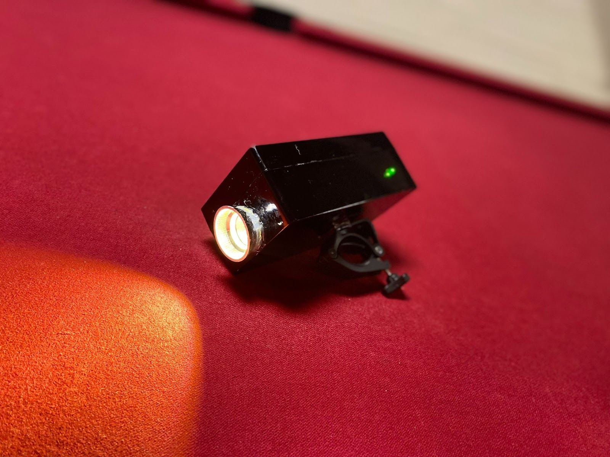
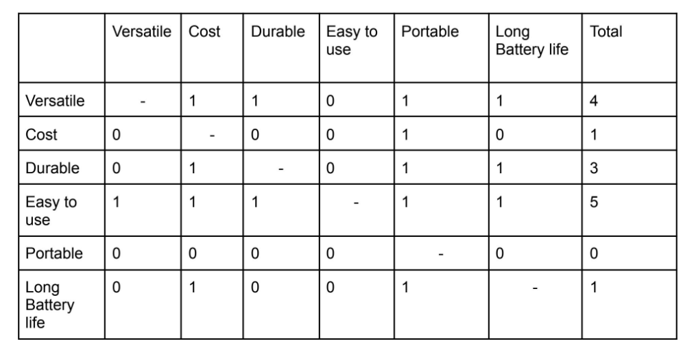
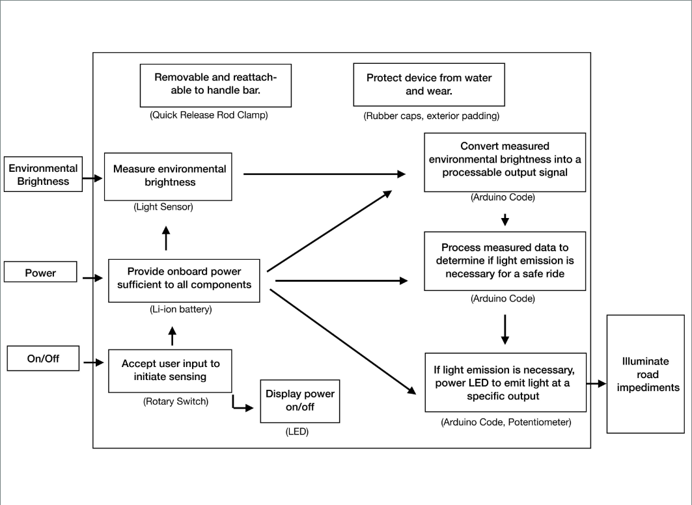
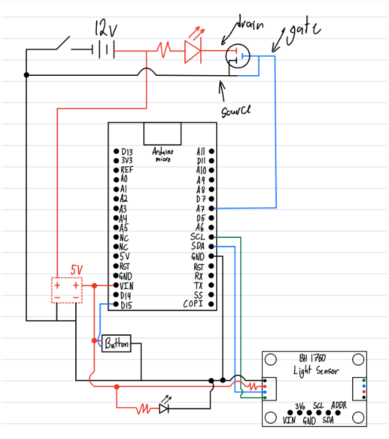
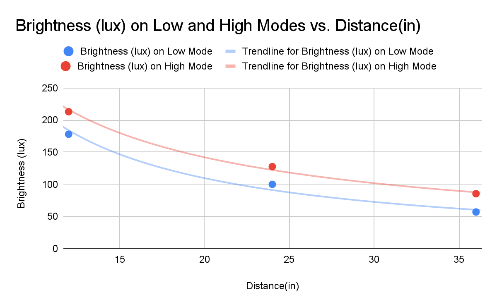
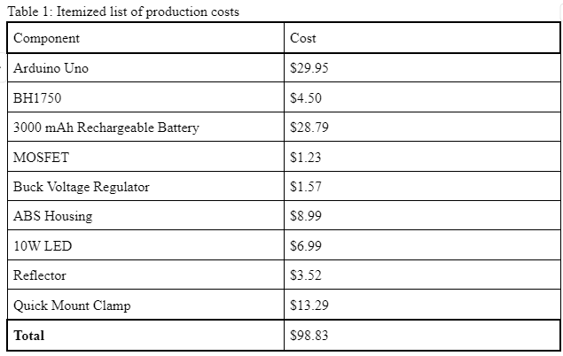
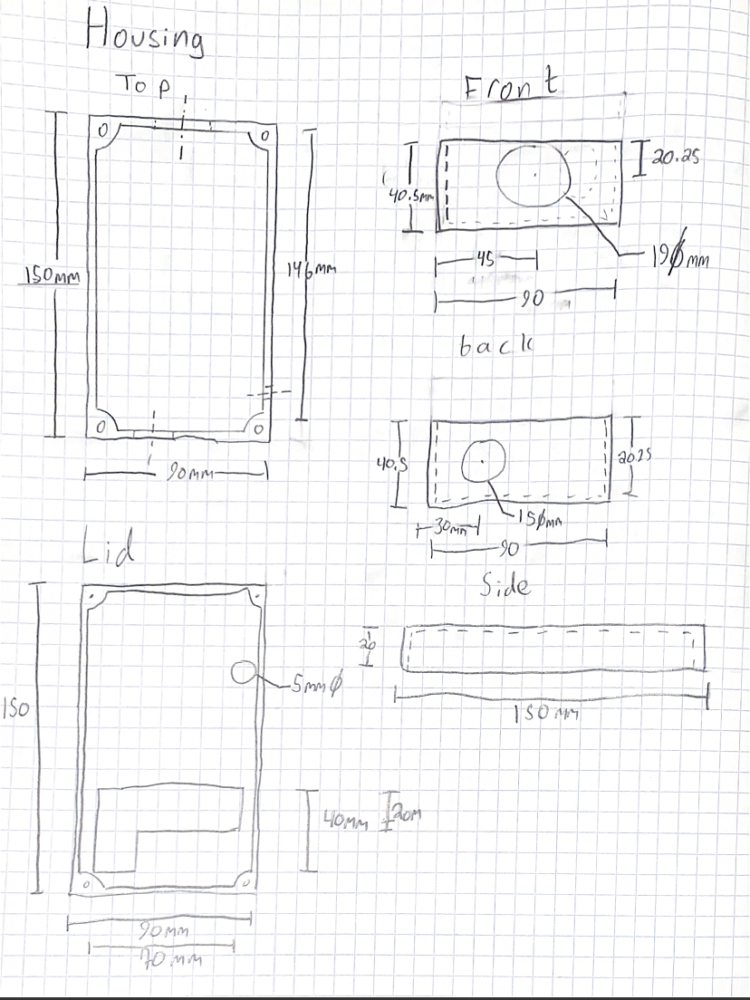
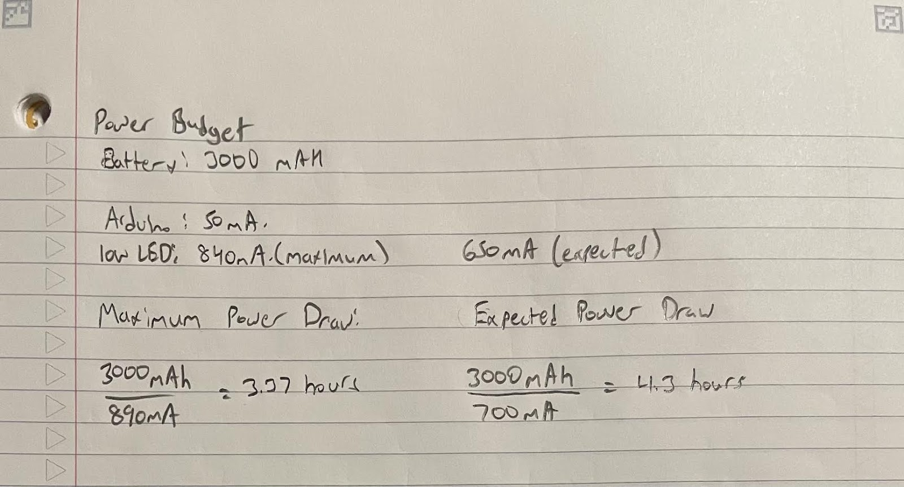

# Hands Free Bike Light - Engineering Design Project
Nicolas Malamug, Barrett Schenk, Andrew Jedrey, Bailey Bishoff

[Original Documentation](https://docs.google.com/document/d/1f6muXlzhTEeYJNFR2FhOeGfwLaKzY07SjDTWxh5QQRY)

## Dependencies

[BH 1750 Sensor Library](https://github.com/Starmbi/hp_BH1750)

## Executive Summary

Biking is now seen as a fast, environmentally friendly option to cars and travel on foot. However, it comes with its own set of dangers. Biking at night carries heavy risks, especially with unseen obstacles like pedestrians, cars, and bumps on the road. Though there are many bike lights on the market, they are often large, clunky to use, and rely on non rechargeable batteries. Because of this, we decided to design the Bike Beam, a small, hands-free, auto-brightness-adjustable, power-efficient, rechargeable bike light. 

In order to design and manufacture such a product, much research was required to choose parts and layouts. In our finalized design, we used an ABS Housing, a 10W LED, a BH1750 light sensor, a 3000mA hour battery, a quick release clamp, and an Arduino Uno as the main components. The Arduino was used to modulate the light’s power based on the lighting conditions, gathered from the readings on the BH1750 light sensor. 

Through testing, we determined the Bike Beam provides adequate lighting at a distance of 10m away, while being easy to use. It is easily attachable and detachable, and fits within a small footprint. It also has a relatively low cost for the amount of functionality packed in, and is able to last 4.3 hours on a single charge. 

## Introduction

In a city, biking tends to be a quick, environmentally friendly alternative to cars. Biking at night, however, comes with its own host of challenges. The road becomes dark, and impediments like people and cars become more difficult to see. Focus is a finite resource, and it is important to conserve its use. To tackle this issue, we decided to design the Bike Beam. 

The goal is to design a product to project a headlight for bike riders to ensure clear vision in various lighting conditions. The human eye can make out objects with a brightness of 3 lux. Therefore, the key objectives for our bike light design include illuminating road impediments, projecting a spotlight of a minimum of 3 lux at 15 meters away with a 3-meter spot diameter. We also wanted the light to have a long battery life providing at least 3 hours in high power mode, operate hands-free, fit in 15x15x15cm box, and quickly attach/remove from handlebars in under 30 seconds (Fig. 2).

#### Bike Light Objectives

## Design

In order to increase rider focus on the road, and thus rider safety, the Bike Beam comes with a host of innovative and important design elements.
As an overview, the Bike Beam is a small bike light, which has three main modes, rotated using a push-button. The device starts in “automatic” mode, and push buttons allow a switch to “high” or “low” modes. While high and low modes output a specified amount of light (good for riding in fog or otherwise inadequate conditions for automatic mode), the automatic mode adjusts the brightness of the device based on the surrounding lighting conditions. When a rider’s surroundings are darker, a brighter beam will be projected.

### Systems Glass Box

For light sensing, we decided to use a cutting-edge BH1750 light sensor for its precision and responsiveness to changing light intensities. Paired with a microcontroller, voltage regulator, and a MOSFET, we were able to use the light sensor to modulate the light level of a 10W LED (Fig. 5). By modulating the levels of the 10W LED, less power is used in automatic mode, thus saving electricity and extending battery life. 

#### Circuit Diagram

There was also much innovative design in the software. In order to make the light accurately adjust to surrounding light levels, a moving average was used. Another advantage of using a moving average is that the Bike Beam is less sensitive to noisy or quick-changing lighting conditions than potential competitors, while still being highly adaptable and responsive. 

A potential issue in automatic mode was that the beam would dip to a lower brightness than desired when passing under a street light. To counteract this, we implemented a light sensor debouncing algorithm. When the light level passes above a certain threshold, the Bike Beam will remain bright for 3 seconds, as an average rider is expected to be under a street light for no more than 1.5 seconds (Fig. 11). After 3 seconds passes, the Bike Beam will adapt to its new surroundings: if it is dark outside, the beam will remain bright. If the surroundings are bright, the beam will dim or turn off entirely to save power and prevent glare. 

Another major consideration for our design was safety and reliability. The main places this was considered was in electrical safety, heat management, and water resistance. For electrical safety, a buck step-down voltage regulator was used as a hardware fallback to ensure that the LED cannot be over-volted. This prevents the LED from burning out in the case of an electrical malfunction. The 10W LED also generates a lot of heat. To manage this, we used heatsinks to sap heat away from the diode, along with silicone adhesive, which has a melting point of over 1400 degrees celsius. The housing was also made water-resistant using an ABS exterior, with silicone sheets cut to fit over any gaps or holes. 

Another priority was ease of use. In order to make our light easy to use, we 3D printed a button cap to effectively make the button bigger. The ABS housing is small, and covers a footprint of 15.8 x 9.0 x 6.0 cm (Fig. 12). We used a quick release mounting clip to ensure quick mounting and dismounting. We also had a green LED indicator for when the device was on, along with a battery indicator. The light is also rechargeable with a 3000mAh lithium-ion battery providing approximately 4.3  hours of operating time. 

## Results

In our testing, we were able to test and verify our various metrics. 

The first metric we verified was the ease of use of the device. As the device has three modes, and can be tuned with just a switch and button before a bike ride. The light debouncing algorithm allows a rider to stay focused on the road, even under variable lighting conditions. 

The light is also very versatile, and is able to provide 3 lux of illumination 10 meters away. This was tested using the brightness levels of the light at certain distances, and extrapolating to 10 meters. We were able to achieve a brightness level of 3.2 lux at 10m (Fig. 9). 

#### Light Level Testing

Durability was tested through water spray in all different directions. The device continued to function after continuous spray from all directions, achieving the IPX rating of 4. 

We were also able to achieve our cost goal of $100. When adding together the cost of all components in our design, we get a total cost of $98.83 (Table 1).

#### Costs Breakdown

The design is also very portable. The device weighs less than 0.5kg, fits in a 15x15x15cm footprint, and can be removed and attached in less than 30 seconds.  

#### Housing Sketch

Although we were unable to achieve our battery life goal, the battery can still last nearly 4 hours (Fig. 7) in high mode, the least power efficient mode. This is a far cry from the intended 12 hours, but is still enough for long rides. 

#### Battery Life

